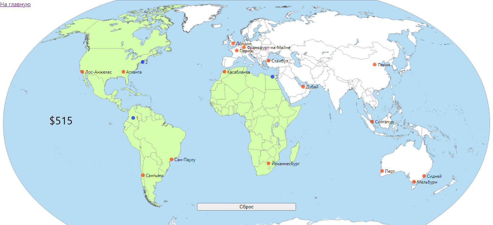

Игра "Кругосветка"
========================

Предисловие
-------------------------
Игра основана на знаменитой [Задачи коммивояжёра](https://ru.wikipedia.org/wiki/%D0%97%D0%B0%D0%B4%D0%B0%D1%87%D0%B0_%D0%BA%D0%BE%D0%BC%D0%BC%D0%B8%D0%B2%D0%BE%D1%8F%D0%B6%D1%91%D1%80%D0%B0 "Статья в Википедия: Задача коммивояжёра") 
— одна из самых известных задач комбинаторной оптимизации, 
заключающаяся в поиске самого выгодного маршрута, проходящего
через указанные города хотя бы по одному разу с последующим 
возвратом в исходный город. Проблема задачи заключается в гигантском 
увеличении вариантов прохождения маршрута, при увеличении числа городов.
Так например задача с 5-ю городами дает 120 вариантов 
маршрутов (5!=120), с 10-ю городами - 3.628.800 вариантов (10!), с 20-ю городами - 
уже числа с 18 нулями (20!).

Правила игры
-------------------------
Правила игры очень простые. Нужно посетить все континенты 
самым дешевым маршрутом. Стартовать можно из любого города. 
Город можно посетить только один раз. Не обязательно посещать 
все города, главное посетить все шесть континентов. Пока в игре 19 городов, 
теоретически количество маршрутов 19! ~ 120 квадриллионов (120 с 15-ю нулями).

Цены на перелеты реальные, взяты из [Авиасейлс](https://www.aviasales.ru/).

Применяемые технологии
-------------------------
Фронтенд написан на ReactJS в связке с Redux. Запрос к API с помощью axios. Работа с формами организована 
с помощью библиотеки [Formik](https://formik.org/). Валидация форм - с помощью Yup.

Бэкэнд: простая база сохраненных результатов, организована с помощью
[mockapi.io](https://mockapi.io/).

